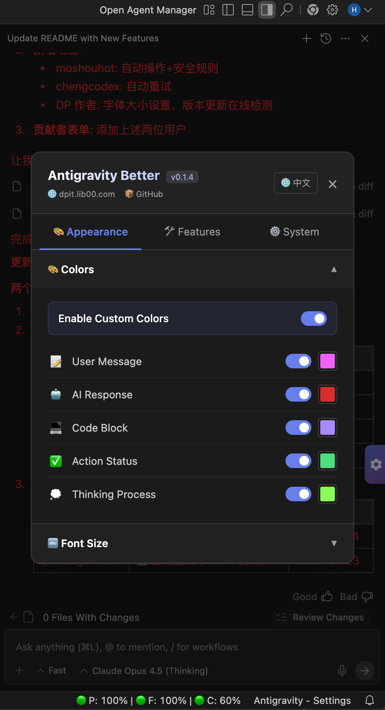
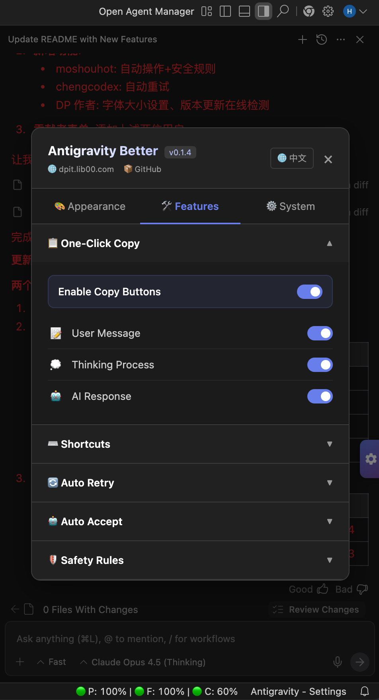

<div align="center">
  <h1>🚀 Antigravity Better</h1>
  <p><strong>自定义你的 Antigravity AI 聊天面板。你的 IDE，你做主。</strong></p>
  <p><strong>Customize your Antigravity AI chat panel. Your IDE, your rules.</strong></p>
  <br>
  <p>
    <strong>English</strong> •
    <a href="./README_ZH.md">中文</a>
  </p>
  <p>
    
    
    
    
    
    <br><br>
    <a href="https://github.com/016/Antigravity-Better/releases"></a>
  </p>
</div>

---

## 📸 Screenshots

<p align="center">
  
  
</p>

---

## ✨ What is Antigravity Better?

**Antigravity Better** is a lightweight, zero-dependency toolkit for customizing the AI chat panel in **Antigravity** - Google's new AI-powered IDE.

We provide a **single HTML file** that you can drop into your IDE to unlock powerful customizations - without touching any source code or installing extensions.

You can freely customize this HTML file to build your own features. Following our pre-built framework makes modifications incredibly easy - just add your CSS rules and JS logic, and you're good to go!

> 💡 **Philosophy**: We build the highway; you drive whatever car you want.

### Compatibility Note

- ✅ **Primary Target**: Antigravity (Google's AI IDE)
- ⚠️ **Potentially Compatible**: Other VS Code-based AI IDEs (Cursor, Windsurf, etc.) may work with modifications, but we cannot guarantee compatibility.

---

## 🚀 Features

### Built-in Customizations

| Feature | Version | Description |
|---------|---------|-------------|
| 🌐 **AI Translator** | 0.1.7 | Inline AI translation of chat messages & input, powered by DeepSeek/OpenRouter via local bridge |
| 🎨 **Custom Colors** | 0.1.1 | Change text colors for user messages, AI responses, code blocks, thinking process, and more |
| 🔤 **Font Size Control** | 0.1.4 | Customize font sizes for different content types with sync-all option |
| 📋 **Copy Buttons** | 0.1.1 | One-click copy for any message type (user, AI, thinking) |
| ⌨️ **Hotkey Override** | 0.1.1 | Change the send shortcut (Enter → Cmd+Enter, Ctrl+Enter, etc.) |
| 🔄 **Auto Retry** | 0.1.2 | Automatically click the Retry button when AI agent errors occur (configurable count & delay) v0.1.6 Merged into Auto Accept  |
| 🤖 **Auto Accept** | 0.1.3 | Auto-click Accept/Run/Apply/Execute/Confirm/Allow buttons with configurable patterns |
| 🛡️ **Safety Rules** | 0.1.3 | Block dangerous commands from auto-execution with customizable blacklist |
| 📐 **LaTeX Rendering** | 0.1.5 | Auto-render LaTeX math formulas ($...$, $$...$$) in AI responses using KaTeX |
| 🔔 **Version Check** | 0.1.4 | Auto/manual check for updates with in-app notification |
| 🌐 **i18n Ready** | 0.1.1 | Built-in English/Chinese/Spanish support, easily extendable to other languages |

### For Developers

- **Single-file architecture**: All CSS/JS/HTML in one file
- **Zero build tools**: No npm, no bundler - just edit and replace
- **Performance-first**: Disabled features = zero runtime cost
- **Well-documented**: Clear code structure with comments
- **Extensible**: Add your own features following simple patterns

---

## 📦 Installation

### Quick Start

1. **Locate the target file**
   ```
   macOS: /Applications/Antigravity.app/Contents/Resources/app/extensions/antigravity/cascade-panel.html
   Windows: [PathToAppFolder]/Antigravity/resources/app/extensions/antigravity/cascade-panel.html
   ```

2. **Backup & Replace**
   ```bash
# Navigate to the installation directory
   ## Mac os
   cd /Applications/Antigravity.app/Contents/Resources/app/extensions/antigravity/
   ## Windows
   cd [PathToAppFolder]/Antigravity/resources/app/extensions/antigravity/

   # Backup original
   cp cascade-panel.html cascade-panel.html.bak
   
   # Replace with Antigravity Better
   cp /path/to/antigravity-better/app_root/cascade-panel.html ./
   ```

3. **Restart Antigravity** - Done! 🎉

> ⚠️ **Note**: Every time Antigravity updates, it will overwrite the HTML file. You'll need to re-apply this replacement after each update.

---

## 🛠️ Customization

### Using the Settings Panel

Click the **⚙️ floating button** on the right side of your chat panel to open settings.

- Switch between **Appearance** and **Features** tabs
- Expand/collapse each feature section
- Toggle language between English/中文

### Adding Your Own Features

Antigravity Better is designed to be extended:

```html
<style>
  /* 1. Add your CSS - only active when feature class is present */
  #react-app.your-feature .target { color: red; }
</style>

<script>
  // 2. Add your feature config
  const YOUR_CONFIGS = [{ id: 'my-feature', ... }];
  
  // 3. Implement your logic (respecting on/off state)
  function applyYourFeature() {
    if (!currentSettings.yourFeatureEnabled) return;
    // Your code here
  }
</script>
```

---

## 🤝 Contributing

We welcome contributions! Whether it's:

- 🐛 Bug reports
- 💡 Feature ideas
- 🔧 Pull requests
- 📖 Documentation

### 🌟 Contributors

A huge thank you to all our amazing contributors! 💖

| Contributor | Contribution | Date |
|-------------|--------------|------|
| [@moshouhot](https://github.com/moshouhot) | 🤖 Auto Accept + 🛡️ Safety Rules - Configurable button auto-click with dangerous command filtering | 2026-01-24 |
| [@chengcodex](https://github.com/chengcodex) | 🔄 Auto Retry - Smart error detection and auto-retry with XPath optimization (merged into Auto Accept in v0.1.6) | 2026-01-23 |

---

## 📜 License

MIT License - Use it, modify it, share it.

---

## 🔗 Links

- 🌐 Website: [dpit.lib00.com](https://dpit.lib00.com)
- 🐛 Issues: [GitHub Issues](https://github.com/016/Antigravity-Better/issues)

---

<div align="center">
  <sub>Built with ❤️ by the Antigravity Better Team</sub>
</div>
