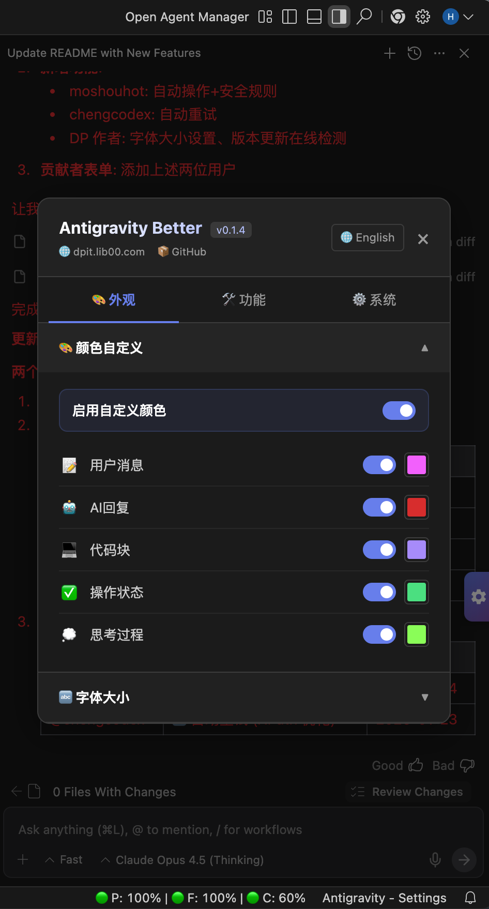
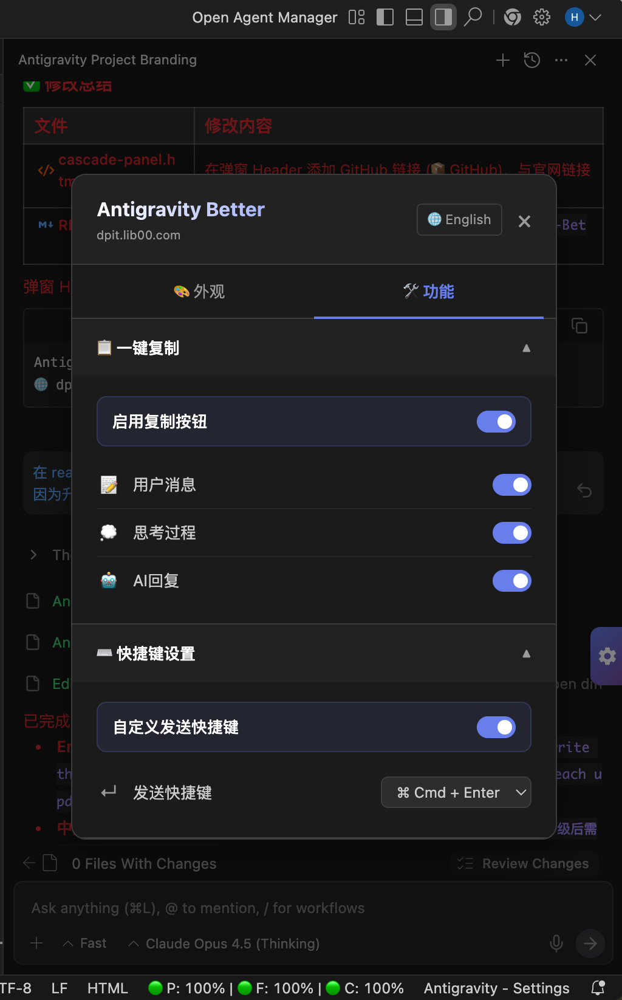

<div align="center">
  <h1>🚀 Antigravity Better</h1>
  <p><strong>自定义你的 Antigravity AI 聊天面板。你的 IDE，你做主。</strong></p>
  <p><strong>Customize your Antigravity AI chat panel. Your IDE, your rules.</strong></p>
  <br>
  <p>
    <a href="./README.md">English</a> •
    <strong>中文</strong>
  </p>
  <p>
    
    
    
    
    
    <br><br>
    <a href="https://github.com/016/Antigravity-Better/releases"></a>
  </p>
</div>

---

## 📸 截图预览

<p align="center">
  
  
</p>

---

## ✨ 什么是 Antigravity Better？

**Antigravity Better** 是一个轻量级、零依赖的工具包，用于自定义 **Antigravity**（Google 推出的 AI IDE）的聊天面板。

我们提供一个 **单一 HTML 文件**，只需替换即可解锁强大的自定义功能 - 无需修改源码或安装扩展。

你可以在我们提供的 HTML 文件上自由定制，开发属于你自己的功能。遵循我们预设的框架进行修改非常简单 - 只需添加你的 CSS 规则和 JS 逻辑即可！

> 💡 **理念**：我们铺好高速公路，你想开什么车都行。

### 兼容性说明

- ✅ **主要目标**：Antigravity（Google AI IDE）
- ⚠️ **可能兼容**：其他基于 VS Code 的 AI IDE（如 Cursor、Windsurf 等）可能需要适配，我们无法保证兼容性。

---

## 🚀 功能特性

### 内置自定义功能

| 功能 |版本 | 说明 |
|------|------|------|
| 🎨 **自定义颜色** | 0.1.1 | 修改用户消息、AI 回复、代码块、思考过程等的文字颜色 |
| 🔤 **字体大小** | 0.1.4 | 为不同内容类型自定义字体大小，支持一键同步 |
| 📋 **一键复制** | 0.1.1 | 为任意消息类型（用户、AI、思考）添加复制按钮 |
| ⌨️ **快捷键覆盖** | 0.1.1 | 修改发送快捷键（Enter → Cmd+Enter、Ctrl+Enter 等） |
| 🔄 **自动重试** | 0.1.2 | 当 AI Agent 运行出错时，自动点击重试按钮（可配置次数和延迟） |
| 🤖 **自动操作** | 0.1.3 | 自动点击 Accept/Run/Apply/Execute/Confirm/Allow 按钮，按钮类型可配置 |
| 🛡️ **安全规则** | 0.1.3 | 危险命令过滤，可自定义黑名单，阻止危险命令自动执行 |
| 📐 **LaTeX 公式** | 0.1.5 | 自动渲染 AI 回复中的 LaTeX 数学公式（$...$、$$...$$），使用 KaTeX 引擎 |
| 🔔 **版本检测** | 0.1.4 | 支持自动/手动检测更新，新版本可用时弹出提醒 |
| 🌐 **多语言支持** | 0.1.1 | 内置中英文，可轻松扩展其他语言 |

### 开发者友好

- **单文件架构**：所有 CSS/JS/HTML 集成在一个文件
- **零构建工具**：无需 npm、无需打包 - 直接编辑替换
- **性能优先**：禁用的功能 = 零运行时开销
- **注释清晰**：代码结构明确，易于理解
- **易于扩展**：按照简单模式添加你自己的功能

---

## 📦 安装方法

### 快速开始

1. **找到目标文件**
   ```
   macOS: /Applications/Antigravity.app/Contents/Resources/app/extensions/antigravity/cascade-panel.html
   Windows: [应用安装目录]/Antigravity/resources/app/extensions/antigravity/cascade-panel.html
   ```

2. **备份并替换**
   ```bash
   # 进入安装目录
   ## Mac os
   cd /Applications/Antigravity.app/Contents/Resources/app/extensions/antigravity/
   ## Windows
   cd [应用安装目录]/Antigravity/resources/app/extensions/antigravity/

   # 备份原文件
   cp cascade-panel.html cascade-panel.html.bak
   
   # 替换为 Antigravity Better
   cp /path/to/antigravity-better/app_root/cascade-panel.html ./
   ```

3. **重启 Antigravity** - 完成！🎉

> ⚠️ **注意**：每次 Antigravity 版本升级时，都会覆盖这个 HTML 文件。升级后需要重新执行一次替换操作。

---

## 🛠️ 自定义配置

### 使用设置面板

点击聊天面板右侧的 **⚙️ 悬浮按钮** 打开设置。

- 在 **外观** 和 **功能** 选项卡之间切换
- 展开/折叠各个功能区块
- 点击右上角按钮切换 中文/English

### 添加自己的功能

Antigravity Better 专为扩展设计：

```html
<style>
  /* 1. 添加 CSS - 仅在功能启用时生效 */
  #react-app.your-feature .target { color: red; }
</style>

<script>
  // 2. 添加功能配置
  const YOUR_CONFIGS = [{ id: 'my-feature', ... }];
  
  // 3. 实现逻辑（遵循开关状态）
  function applyYourFeature() {
    if (!currentSettings.yourFeatureEnabled) return;
    // 你的代码
  }
</script>
```

---

## 🤝 参与贡献

欢迎各种形式的贡献：

- 🐛 Bug 反馈
- 💡 功能建议
- 🔧 Pull Request
- 📖 文档完善

### 🌟 贡献者

感谢所有优秀的贡献者！你们太棒了！💖

| 贡献者 | 贡献内容 | 日期 |
|--------|----------|------|
| [@moshouhot](https://github.com/moshouhot) | 🤖 自动操作 + 🛡️ 安全规则 - 可配置按钮自动点击，支持危险命令过滤 | 2026-01-24 |
| [@chengcodex](https://github.com/chengcodex) | 🔄 自动重试 - 智能错误检测与自动重试，采用 XPath 优化性能 | 2026-01-23 |

---

## 📜 开源协议

MIT License - 自由使用、修改、分享。

---

## 🔗 链接

- 🌐 官网：[dpit.lib00.com](https://dpit.lib00.com)
- 🐛 问题反馈：[GitHub Issues](https://github.com/016/Antigravity-Better/issues)

---

<div align="center">
  <sub>Built with ❤️ by the Antigravity Better Team</sub>
</div>
